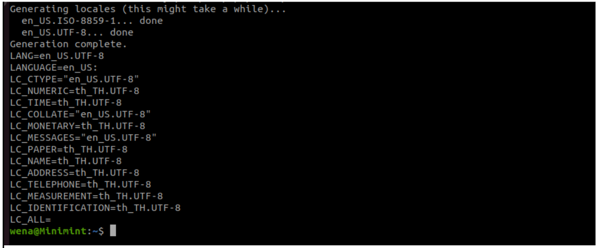
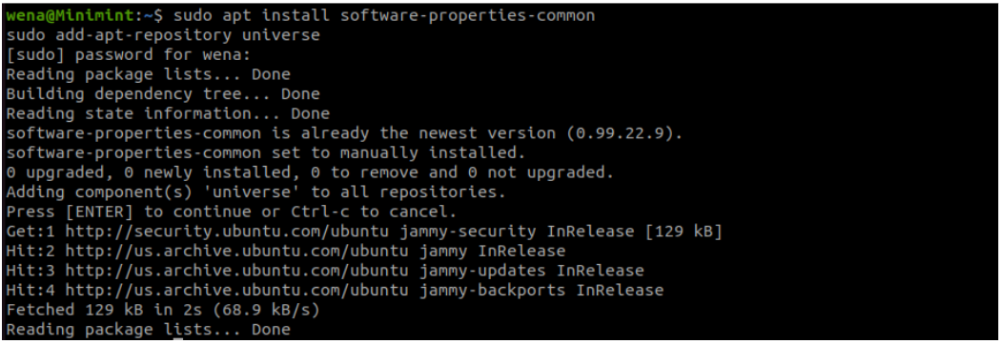
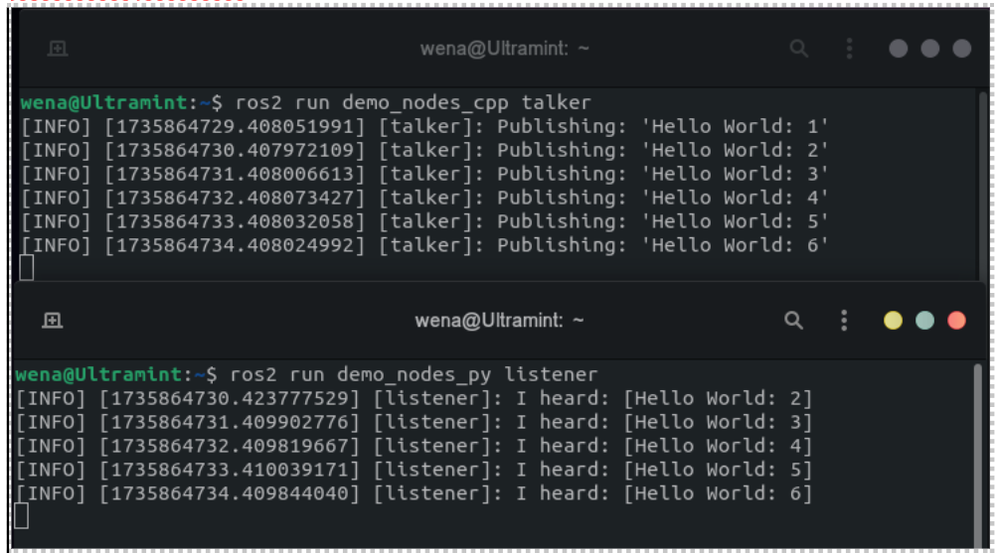

# Installasi ROS 2 Humble di Ubuntu (Windows sama Mac gak di ajak)

Panduan ini menjelaskan langkah-langkah untuk menginstal ROS 2 Humble Hawksbill di Ubuntu dengan menggunakan paket debian (Ubuntu 22.04 direkomendasikan).

---

## 2.1 Kebutuhan Sistem

### Sistem Operasi
- **Ubuntu 22.04 (Jammy Jellyfish)** adalah OS yang secara resmi didukung.
- Sistem operasi lain bisa digunakan, tetapi tidak dijamin kompatibilitasnya.

### Perangkat Keras (Hardware)

#### Prosesor:
- **Minimum**: Prosesor dual-core 64-bit.
- **Rekomendasi**: Prosesor quad-core atau lebih tinggi untuk simulasi yang kompleks.

#### RAM (Memori):
- **Minimum**: 4 GB.
- **Rekomendasi**: 8 GB atau lebih, terutama jika menggunakan banyak node atau simulasi intensif.

#### Penyimpanan (Storage):
- **Minimum**: 10 GB ruang kosong untuk instalasi.
- **Rekomendasi**: Lebih dari 20 GB jika menggunakan proyek besar atau simulasi.

#### Kartu Grafis:
- **Diperlukan**: Dukungan OpenGL untuk alat visualisasi seperti Gazebo dan RViz, atau PyBullet.
- **Rekomendasi**: GPU dedicated seperti NVIDIA jika menggunakan simulasi visual yang berat.

### Perangkat Lunak
- **CMake**: Versi 3.16 atau lebih baru.
- **Python**: Versi 3.11 atau kompatibel.
- **Colcon**: Untuk membangun workspace ROS 2.
- **Compiler**: `gcc`, `g++` (GNU Compiler Collection), dan `make`.
- **Git**: Untuk manajemen kode sumber.
- **Curl/Wget**: Untuk mengambil skrip instalasi.

### Rekomendasi Visual Studio Code

#### Unduh dan Instal VS Code:
- Kunjungi [Visual Studio Code](https://code.visualstudio.com/) untuk mengunduh.
- Pastikan sesuai dengan arsitektur sistem Anda (x64).

#### Ekstensi Wajib untuk ROS 2 di VS Code:
- **ROS Extension Pack**: Instal melalui VS Code Extensions Marketplace. Paket ini mencakup:
  - **ROS**
  - **Python**
  - **C/C++**
- **Colcon Helper**: Mempermudah proses build workspace ROS 2.

---

## 2.2 Instalasi ROS 2 Humble

### Langkah Persiapan
1. Buka terminal dan navigasikan ke [panduan instalasi ROS 2](https://docs.ros.org/en/humble/Installation.html).
2. Pilih bagian instalasi untuk Ubuntu atau sistem operasi yang diinginkan.


---

### Langkah-Langkah Instalasi

#### 1. Set Locale
Set locale digunakan untuk mengatur bahasa dan format data agar konsisten, terutama untuk mencegah error parsing data. Default locale adalah `en_US.UTF-8`.

```bash
locale  

sudo apt update && sudo apt install locales
sudo locale-gen en_US en_US.UTF-8
sudo update-locale LC_ALL=en_US.UTF-8 LANG=en_US.UTF-8
export LANG=en_US.UTF-8

locale  
```


> **Catatan**: Pastikan tidak ada error saat menjalankan perintah ini.

---

#### 2. Setup Resources

**Aktifkan *Universe Repository*:**
```bash
sudo apt update
sudo apt install software-properties-common
sudo add-apt-repository universe
```


**Tambahkan GPG Key:**
```bash
sudo apt update && sudo apt install curl -y
sudo curl -sSL https://raw.githubusercontent.com/ros/rosdistro/master/ros.key | sudo apt-key add -
```

**Tambahkan Repository ROS 2 ke Sources List:**
```bash
echo "deb [trusted=yes] http://packages.ros.org/ros2/ubuntu $(lsb_release -cs) main" | sudo tee /etc/apt/sources.list.d/ros2-latest.list
```

---

#### 3. Instalasi ROS 2 Package
Perbarui repository dan instal ROS 2 Humble Desktop:
```bash
sudo apt update
sudo apt install ros-humble-desktop
```

> **Catatan**: ROS 2 Humble Desktop sudah mencakup alat yang memadai untuk pengembangan dan simulasi.

---

#### 4. Tambahkan ROS 2 ke Environment
Tambahkan ROS 2 ke pengaturan environment untuk memudahkan akses:
```bash
echo "source /opt/ros/humble/setup.bash" >> ~/.bashrc
source ~/.bashrc
```

> **Catatan**: Pastikan tidak ada kesalahan saat menjalankan perintah ini.

---

#### 5. Testing Instalasi
Untuk memverifikasi instalasi:
- **Terminal 1**:
  ```bash
  ros2 run demo_nodes_cpp talker
  ```
- **Terminal 2**:
  ```bash
  ros2 run demo_nodes_cpp listener
  ```

Jika kedua terminal saling bertukar pesan, instalasi berhasil.


---

## Catatan Penting
Jika Anda merasa kesulitan memahami ROS 2, ingatlah bahwa ini adalah bagian dari proses belajar. Namun, jika benar-benar menyerah, Anda dapat menjalankan perintah berikut untuk hiburan:
```bash
echo "Tetap semangat belajar ROS 2! 😊"
