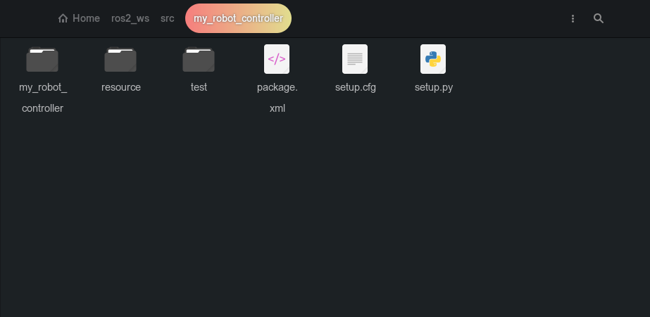

# Kenali dan Buat ROS 2 Package
## Prasyarat
Pastikan Anda memiliki workspace ROS 2 yang sudah dikonfigurasi. Jika belum, lihat episode sebelumnya untuk panduan tentang cara mengatur workspace ROS 2.

---

## **Apa itu Paket dalam ROS 2?**

Paket adalah unit dasar organisasi dalam ROS 2. Setiap proyek, pustaka, atau node dalam ROS 2 dikelompokkan ke dalam paket. Paket bertujuan untuk:

1. **Organisasi:** Mengelompokkan kode, data, dan konfigurasi agar mudah dipelihara.
2. **Modularitas:** Memisahkan bagian-bagian aplikasi menjadi modul kecil yang lebih mudah dikelola.
3. **Dependency Management:** Mengatur dependensi antar paket dengan jelas.

Sebuah paket dapat terdiri dari:
- **Node:** Program eksekusi utama.
- **Konfigurasi:** File konfigurasi untuk mengatur fungsi atau parameter.
- **Dokumentasi:** Metadata tentang paket dalam `package.xml`.
- **Library:** Pustaka khusus untuk digunakan oleh node atau aplikasi lain.

Dalam episode ini, kita membuat paket Python untuk mengontrol robot.

---

## **Langkah-Langkah Membuat Paket**

### **1. Navigasi ke Direktori Source**
Masuk ke folder `src` di dalam workspace ROS 2 Anda:
```bash
cd ~/ros2_ws/src
```

### **2. Buat Paket Baru**
Jalankan perintah berikut untuk membuat paket:
```bash
ros2 pkg create my_robot_controller --build-type ament_python --dependencies rclpy
```
Penjelasan:
- `my_robot_controller`: Nama paket. Anda bisa mengganti ini sesuai kebutuhan.
- Gunakan **underscore (`_`)** jika nama memiliki lebih dari satu kata.
- `--build-type ament_python`: Paket menggunakan Python sebagai bahasa utama.
- `--dependencies rclpy`: Menambahkan pustaka Python ROS 2 sebagai dependensi.

### **3. Buka Paket dengan Visual Studio Code**
Buka direktori `src` workspace Anda dengan VS Code:
```bash
code .
```

---

## **Penjelasan Berkas dalam Paket**
Setelah membuat paket, Anda akan memiliki struktur direktori seperti ini:

   <p align="center">
     
   </p>

```plaintext
my_robot_controller/
├── package.xml
├── setup.py
├── setup.cfg
├── resource/
├── my_robot_controller/
│   └── __init__.py
└── test/
```

1. **`package.xml`**
   - Metadata tentang paket, seperti nama, deskripsi, versi, email pemelihara, lisensi, dan dependensi.
   - Jika paket Anda membutuhkan paket lain sebagai dependensi, tambahkan tag `<depend>` di sini.

2. **`setup.cfg`**
   - Mengatur lokasi file-node Python yang akan diinstal oleh ROS 2. Jangan edit file ini.

3. **`setup.py`**
   - Skrip konfigurasi untuk pemasangan paket. Anda dapat menambahkan pengaturan tambahan seperti _entry points_ untuk node.

4. **Direktori `resource/` dan `test/`**
   - Tidak perlu diubah untuk sekarang.

5. **`__init__.py`**
   - File Python di folder ini merupakan titik awal untuk penulisan node.

> **Catatan**: Struktur direktori tiap paket bisa berbeda tergantung dari keperluan developer, jadi tidak perlu membatasi diri dalam mengubah struktur paketnya

---

## **4. Bangun Paket**
Masuk ke direktori root workspace ROS 2 Anda dan jalankan:
```bash
cd ~/ros2_ws/
colcon build
```

Jika menemukan error terkait `setuptools`, ikuti langkah berikut:

### Perbaikan `setuptools` (Jika Diperlukan):
1. Periksa versi `setuptools`:
   ```bash
   pip3 list | grep setuptools
   ```

2. Jika versi bermasalah, turunkan ke versi `58.2.0` dengan perintah berikut:
   ```bash
   pip3 install setuptools==58.2.0
   ```

3. Coba bangun kembali:
   ```bash
   colcon build
   ```

### Verifikasi:
Setelah berhasil, paket Anda akan terlihat di direktori `install/` workspace:
```bash
ls install/my_robot_controller
```
Direktori yang telah dihasilkan dalam `install/my_robot_controller` meliputi:
- **`lib`**: Berisi pustaka yang dapat dijalankan terkait node dan dependensi Python lainnya.
- **`share`**: Berisi file metadata dan sumber daya seperti deskripsi paket.

---

## **5. Menulis Node ROS 2**
Sekarang Anda siap untuk menulis node Python di dalam paket. Gunakan Visual Studio Code atau editor teks favorit Anda untuk mengedit file.

---

## **Langkah Selanjutnya**
Silakan lanjutkan ke BAB berikutnya untuk mempelajari cara menulis node ROS 2 dengan Python.

---

## **Sumber Tambahan**
Untuk pembelajaran yang lebih lengkap, pertimbangkan mengikuti kursus ROS 2 10-jam. Detail ada di deskripsi seri tutorial.
