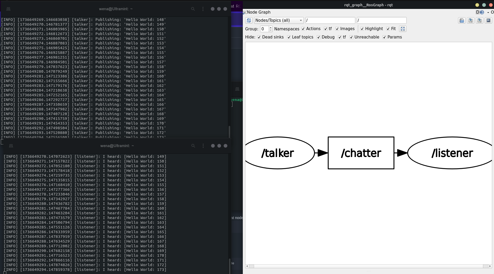
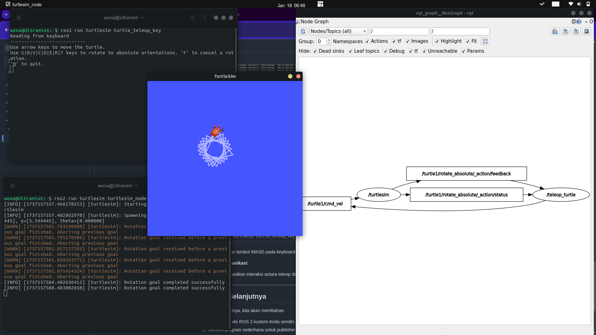
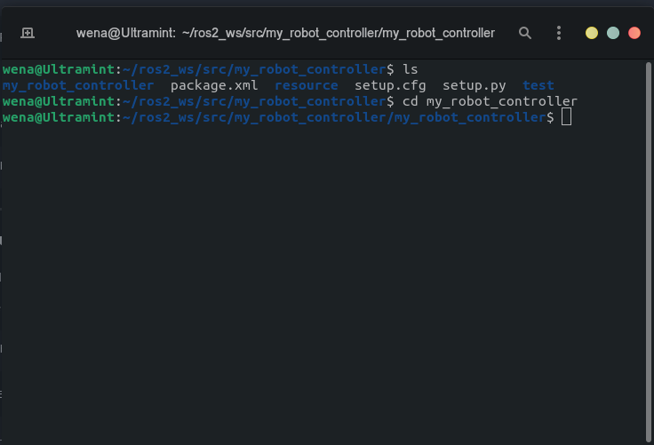
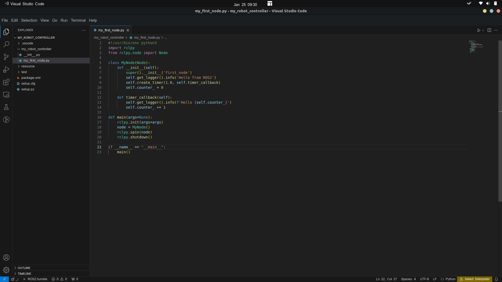
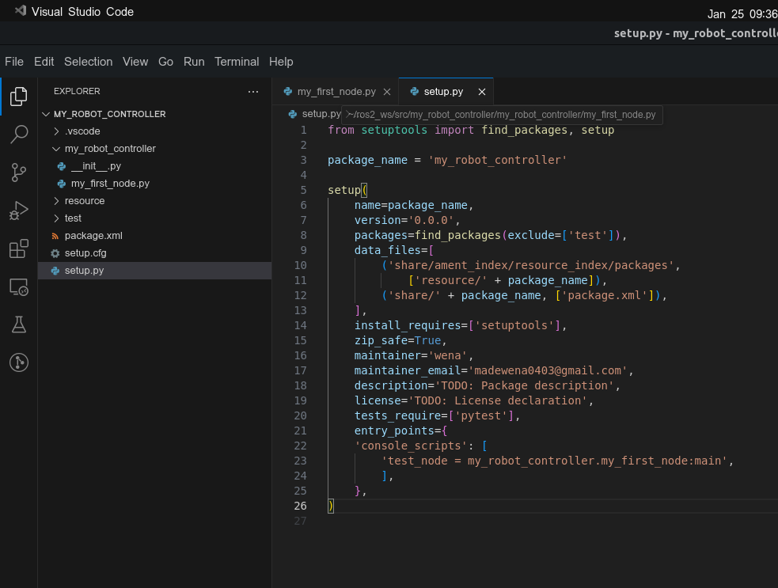
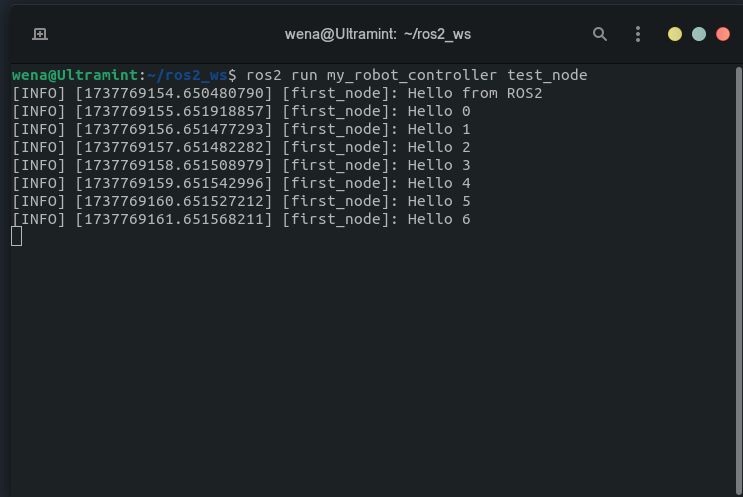
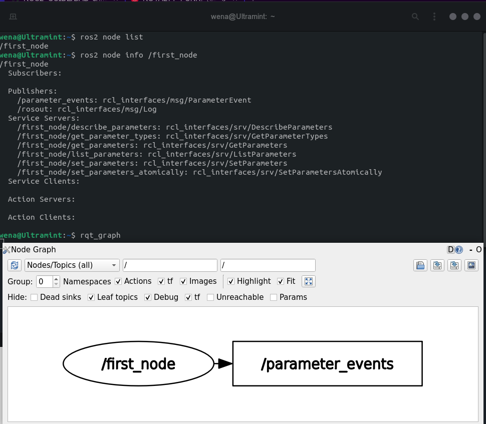

# Salam Kenal Node

## Pengenalan Node ROS 2

Node adalah unit utama dalam sistem **Robot Operating System 2 (ROS 2)**. Setiap node berjalan sebagai program independen yang dapat bekerja secara terpisah maupun bersama dengan node lainnya untuk membentuk suatu sistem yang kompleks. Berikut adalah tugas-tugas utama dari sebuah node dalam ROS 2:

### Tugas Node dalam ROS 2

1. **Mempublikasikan Pesan**  
   Node dapat mengirimkan data (informasi) ke node lain melalui **topik** tertentu. Proses ini disebut sebagai _publishing_, dan data yang dikirimkan dapat berupa teks, angka, sensor, gambar, dan lain-lain.

2. **Berlangganan Pesan**  
   Node dapat menerima data dari node lain melalui **topik** yang telah mereka daftarkan. Proses ini disebut sebagai _subscribing_. Berlangganan memungkinkan node untuk berinteraksi atau merespon data dari node lain.

3. **Mengelola Perangkat Keras atau Antarmuka Eksternal**  
   Node sering digunakan untuk berkomunikasi langsung dengan perangkat keras, seperti sensor, aktuator, atau pengendali. Node bertugas mengambil data dari perangkat keras atau mengirimkan perintah untuk menggerakkan perangkat.

4. **Menyediakan atau Menggunakan Layanan (Services)**  
   Node dapat menyediakan layanan (_service_), yaitu fungsi yang dapat dipanggil oleh node lain untuk melakukan tugas tertentu. Contohnya adalah perhitungan sederhana atau kontrol perangkat.

5. **Berinteraksi melalui Aksi (Actions)**  
   Node dapat mengatur atau menjalankan aksi (_action_), yaitu tugas yang lebih kompleks dan memakan waktu. Aksi biasanya digunakan dalam skenario seperti navigasi robot atau manipulasi lengan robotik.

6. **Membuat Antarmuka Grafis**  
   Node dapat bertugas membangun **Graphical User Interface (GUI)** yang memudahkan pengguna untuk berinteraksi dengan sistem ROS 2, misalnya untuk visualisasi data atau kontrol perangkat keras.

7. **Mengatur Logika Sistem atau Pemrosesan Data**  
   Node dapat diprogram untuk menangani logika pemrosesan, seperti filter data sensor, algoritma kontrol, hingga penerapan _machine learning_.
   
---

## Komunikasi Publisher-Subscriber dengan Topic pada ROS

Dalam ROS (Robot Operating System), komunikasi antar-node dilakukan melalui mekanisme yang disebut *topics*. *Topics* memungkinkan pengiriman dan penerimaan data antar-*nodes* tanpa mereka harus terhubung secara langsung. Berikut adalah penjelasan detail mengenai konsep ini dan elemen-elemen utamanya:

### **Elemen Dasar**

#### **1. Apa itu Publisher?**
*Publisher* adalah bagian dari *node* (program) yang bertanggung jawab untuk **mengirimkan data atau pesan** ke sistem ROS melalui sebuah *topic*. 
- Ibarat orang yang berbicara di sebuah saluran radio.
- **Contoh**: Sebuah *node* sensor pengukur suhu mengirimkan data suhu melalui *topic* bernama `/temperature`.

#### **2. Apa itu Subscriber?**
*Subscriber* adalah bagian dari *node* yang bertugas untuk **menerima data atau pesan** dari sistem ROS melalui sebuah *topic* yang spesifik.
- Ibarat orang yang mendengarkan saluran radio tertentu untuk mendapatkan informasi.
- **Contoh**: Sebuah *node* pengontrol membaca data suhu dari *topic* `/temperature` untuk mengambil keputusan, seperti menyalakan kipas.

#### **3. Apa itu Topic?**
*Topic* adalah saluran komunikasi yang digunakan oleh ROS untuk **menghubungkan publisher dengan subscriber**. 
- Ibarat saluran radio tempat berbagi informasi.
- *Publisher* mengirimkan pesan ke sebuah *topic*, sedangkan *subscriber* akan menerima pesan dari *topic* tersebut.
- Nama *topic* biasanya dalam format string unik seperti `/velocity`, `/camera/image`, atau `/lidar/scan`.

### **Bagaimana Publisher, Subscriber, dan Topic Bekerja Bersama?**

Komunikasi melalui *topics* tidak hanya bersifat satu ke satu (*point-to-point*), tetapi juga mendukung pola komunikasi berikut:

1. **Satu ke Banyak** (*One-to-Many*):
   - Satu *node* bertindak sebagai *publisher* dan mengirimkan pesan yang dapat diterima oleh beberapa *nodes* lain sebagai *subscribers*.
   
2. **Banyak ke Satu** (*Many-to-One*):
   - Beberapa *nodes* menjadi *publishers* dan mengirimkan data ke satu *node* yang menjadi *subscriber*.

3. **Banyak ke Banyak** (*Many-to-Many*):
   - Kombinasi di mana banyak *nodes* berperan sebagai *publishers* dan *subscribers* sekaligus.

#### **Contoh Kehidupan Sehari-hari:**
Bayangkan sebuah stasiun radio (*topic*):
- **Publisher:** Penyiar radio berbicara di saluran (misalnya, frekuensi 101.1 FM).
- **Subscriber:** Pendengar radio yang menyetel saluran 101.1 FM untuk mendengarkan.
- Semua orang yang mendengarkan frekuensi tersebut menerima pesan yang sama dari penyiar.

Dalam ROS, analoginya adalah pesan yang diterbitkan ke sebuah *topic* dapat "didengar" oleh banyak *subscriber*, atau beberapa *publisher* dapat mengirim pesan ke *topic* yang sama.

---
## **Contoh Ilustrasi**


GIF menunjukkan bagaimana sebuah sistem komunikasi berbasis *topic* bekerja:

1. Sebuah *node* yang bertindak sebagai **publisher** mengirimkan pesan melalui *topic* tertentu.
2. Beberapa *nodes* lain yang berperan sebagai **subscribers** telah terhubung ke *topic* yang sama.
3. **Proses Pengiriman:**
   - Pesan yang diterbitkan oleh *publisher* dikirimkan melalui *topic*.
   - Semua *subscriber* yang "berlangganan" ke *topic* tersebut menerima pesan secara bersamaan.

### **Pola Komunikasi:**
- **Satu Publisher, Banyak Subscriber:** 
  - Sebuah *publisher* menerbitkan pesan, yang diterima oleh dua *subscriber*.
- Mekanisme ini memvisualisasikan fleksibilitas komunikasi *topics* dalam mendukung berbagai skenario seperti distribusi data sensor atau penyebaran perintah kontrol. seingga memungkikan dalam melakukan multitasking tnpa menghentikan perintah lain.

> Dengan memahami *topics*, *publishers*, dan *subscribers*, kita dapat merancang sistem robotik yang modular dan efisien, di mana komponen-komponennya dapat saling berkomunikasi secara asinkron tanpa terhubung secara langsung satu sama lain.

---
## Alat yang Dibahas

1. **Alat Command-line:**
   - `ros2 run`: Menjalankan node dari paket yang telah terinstal.
   - `rqt_graph`: Memvisualisasikan grafik ROS.

2. **Node Contoh yang Sudah Terinstal:**
   - Paket: `demo_nodes_cpp`
   - Node: `talker`, `listener`

3. **Paket TurtleSim:**
   - `turtlesim_node`: Simulasi 2D dengan tampilan grafis.
   - `turtle_teleop_key`: Node teleoperation menggunakan keyboard.


---
## Contoh 

### Menjalankan Node Contoh
1. **Node Talker**:
    ```bash
    ros2 run demo_nodes_cpp talker
    ```
    - Mempublikasikan pesan "Hello World" dengan penghitung.

2. **Node Listener**:
    ```bash
    ros2 run demo_nodes_cpp listener
    ```
    - Berlangganan pesan yang dipublikasikan oleh node `talker`.

3. **Memvisualisasikan Komunikasi:**
    - Jalankan `rqt_graph` untuk melihat node dan topik dalam grafik ROS.
    ```bash
    rqt_graph
    ``` 
   <p align="center">
     
   </p>

   Bila kita lihat dari gambar terlihat bahwa node *talker* mengirim topic berupa *chatter* kepada *listener*
   
### Contoh TurtleSim
1. **Jalankan Node TurtleSim:**
    ```bash
    ros2 run turtlesim turtlesim_node
    ```
    - Meluncurkan simulasi grafis dengan seekor kura-kura.

2. **Kendali Kura-kura:**
    ```bash
    ros2 run turtlesim turtle_teleop_key
    ```
    - Gunakan tombol WASD pada keyboard untuk menggerakkan kura-kura dalam simulasi.

3. **Amati Komunikasi:**
    - Visualisasikan interaksi antara teleop dan turtlesim menggunakan `rqt_graph`.

   <p align="center">
     
   </p>
   
---

# Node Hello World ROS2

Bagian ini akan memberikan langkah-langkah dan penjelasan untuk membuat node ROS2 pertama Anda menggunakan Python. Node ini menunjukkan fungsi dasar ROS2 seperti logging, timer, dan spin untuk menjaga node tetap aktif.

## Prasyarat
- ROS2 sudah terpasang di sistem Anda (misalnya, ROS2 Humble).
- Python3.
- Visual Studio Code (disarankan) dengan ekstensi ROS dan Python terpasang.

---

## Langkah-Langkah : 

### 1. Siapkan Workspace Anda
Navigasi ke workspace ROS2 Anda:
```bash
cd ~/ros2_ws/src
```

Buat paket ROS2 baru bernama `my_robot_controller` jika belum ada:
```bash
ros2 pkg create my_robot_controller --build-type ament_python
```

Masuk ke dalam paket:
```bash
cd my_robot_controller
```
  <p align="center">
     
   </p>
---

### 2. Membuat File Node Python

#### Buat File Node
Navigasi ke folder paket:
```bash
cd my_robot_controller
```

Gunakan perintah `touch` untuk membuat file Python baru:
```bash
touch my_first_node.py
```

Buat file tersebut dapat dieksekusi:
```bash
chmod +x my_first_node.py
```

---

### 3. Menulis Kode Node
Buka main directory untuk package:
```bash
cd ~/ros2_ws/src/my_robot_controller
```

Buka file `my_first_node.py` di Visual Studio Code:
```bash
code .
```

Edit file `my_first_node.py` dan tambahkan kode berikut:

```python
#!/usr/bin/env python3
import rclpy
from rclpy.node import Node

class MyNode(Node):
    def __init__(self):
        super().__init__('first_node')
        self.get_logger().info('Hello from ROS2')
        self.create_timer(1.0, self.timer_callback)
        self.counter_ = 0

    def timer_callback(self):
        self.get_logger().info(f'Hello {self.counter_}')
        self.counter_ += 1

def main(args=None):
    rclpy.init(args=args)
    node = MyNode()
    rclpy.spin(node)
    rclpy.shutdown()

if __name__ == "__main__":
    main()
```
   <p align="center">
     
   </p>
---

#### Penjelasan Kode

##### Header
```python
#!/usr/bin/env python3
```
Shebang untuk menentukan interpreter Python 3 secara eksplisit.

---

##### Import Library
```python
import rclpy
from rclpy.node import Node
```
- **`rclpy`**: Library utama untuk ROS 2 di Python.
- **`Node`**: Kelas dasar yang digunakan untuk membuat node ROS 2.

---

##### Kelas MyNode
```python
class MyNode(Node):
    def __init__(self):
        super().__init__('first_node')
        self.get_logger().info('Hello from ROS2')
        self.create_timer(1.0, self.timer_callback)
        self.counter_ = 0
```
1. **`super().__init__('first_node')`**  
   - Menginisialisasi node dengan nama `first_node`.

2. **`self.get_logger().info('Hello from ROS2')`**  
   - Logging untuk memberikan informasi bahwa node berhasil dijalankan.

3. **`self.create_timer(1.0, self.timer_callback)`**  
   - Membuat timer yang memanggil fungsi `timer_callback` setiap 1 detik.

4. **`self.counter_ = 0`**  
   - Inisialisasi counter dengan nilai awal 0.

---

##### Fungsi Callback
```python
def timer_callback(self):
    self.get_logger().info(f'Hello {self.counter_}')
    self.counter_ += 1
```
- Fungsi yang dipanggil oleh timer setiap 1 detik.
- **`self.get_logger().info(f'Hello {self.counter_}')`**  
  - Menampilkan log dengan nilai `counter_` yang terus meningkat.
- **`self.counter_ += 1`**  
  - Meningkatkan nilai `counter_` setiap kali callback dipanggil.

---

##### Fungsi Utama
```python
def main(args=None):
    rclpy.init(args=args)
    node = MyNode()
    rclpy.spin(node)
    rclpy.shutdown()
```
1. **`rclpy.init(args=args)`**  
   - Menginisialisasi komunikasi ROS 2.

2. **`node = MyNode()`**  
   - Membuat instance dari kelas `MyNode`.

3. **`rclpy.spin(node)`**  
   - Menjaga node tetap berjalan dan menerima callback.

4. **`rclpy.shutdown()`**  
   - Menghentikan komunikasi ROS 2 setelah node selesai dieksekusi.

---

##### Eksekusi
```python
if __name__ == "__main__":
    main()
```
Memastikan script hanya dijalankan saat dipanggil langsung, bukan diimport.

---

### 4. Membangun dan Menjalankan Node

#### Perbarui `setup.py`

Tambahkan executable ke bagian `entry_points` di file `setup.py`:

```python
entry_points={
    'console_scripts': [
        'test_node = my_robot_controller.my_first_node:main',
    ],
},
```
   <p align="center">
     
   </p>
   
#### Bangun Workspace
Kembali ke root workspace Anda dan bangun:
```bash
cd ~/ros2_ws
colcon build
```

Source lingkungan:
```bash
source install/setup.bash
```

#### Jalankan Node
Jalankan node menggunakan CLI ROS2:
```bash
ros2 run my_robot_controller test_node
```

#### Output yang Diharapkan
Node akan mencetak:
```
[INFO] [timestamp] [first_node]: Hello from ROS2
[INFO] [timestamp] [first_node]: Hello 0
[INFO] [timestamp] [first_node]: Hello 1
... (dicetak setiap detik)
```
 <p align="center">
     
   </p>
   
---

### 5. Debugging dan Inspeksi

#### Perintah CLI ROS2

- **Daftar node yang berjalan**
  ```bash
  ros2 node list
  ```

- **Informasi node**
  ```bash
  ros2 node info /first_node
  ```

- **Visualisasi Graf ROS**
  Pasang dan jalankan `rqt_graph` untuk memvisualisasikan:
  ```bash
  sudo apt install ros-humble-rqt-graph #Jlankan jika belum meingstall
  rqt_graph
  ```

---

### Opsional: Tingkatkan Kecepatan Pengembangan

#### Aktifkan Instalasi Symlink
Untuk pengembangan Python, aktifkan instalasi symlink untuk menghindari pembangunan ulang setelah setiap perubahan:
```bash
colcon build --symlink-install
```

Ini memungkinkan Anda langsung menjalankan kode yang diperbarui tanpa membangun ulang:
```bash
ros2 run my_robot_controller test_node
```
 <p align="center">
     
   </p>

---

### Tips untuk Penamaan File dan Node
- **Nama File**: `my_first_node.py`.
- **Nama Executable**: Didefinisikan di `setup.py` (misalnya, `test_node`).
- **Nama Node**: Didefinisikan di konstruktor `Node` (misalnya, `first_node`).

Pastikan untuk membedakan nama-nama ini karena memiliki tujuan yang berbeda.

---

## Kesimpulan
Selamat! Anda telah berhasil membuat dan menjalankan node ROS2 pertama Anda. Pengaturan dasar ini dapat diperluas untuk membangun aplikasi ROS2 yang lebih kompleks. 🎉

---

## Sumber Tambahan


Terima kasih telah mengikuti tutorial ini. Sampai jumpa di tutorial berikutnya!

