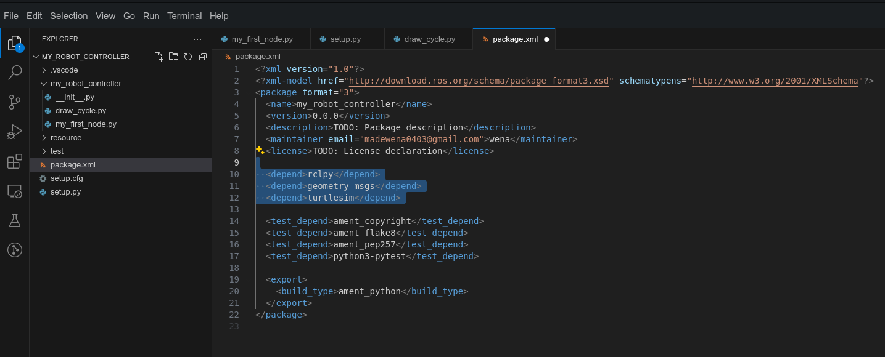
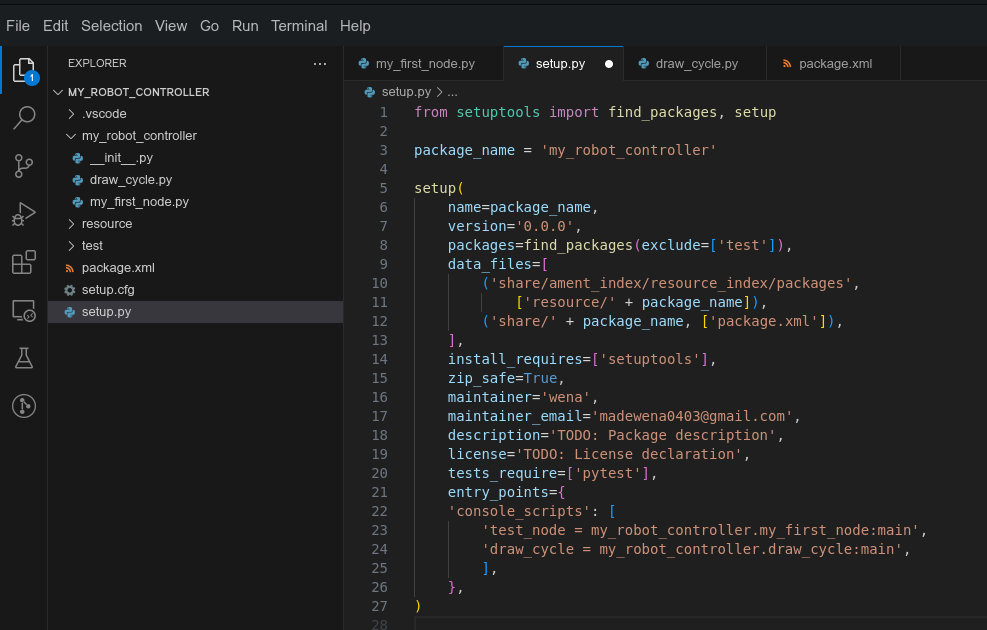
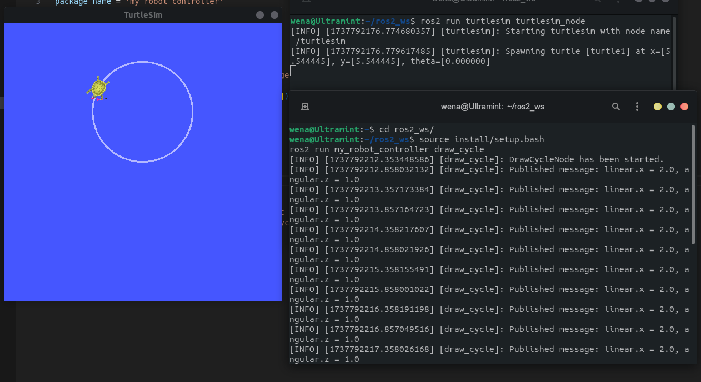

# ROS 2 Publisher Node - Draw Circle

Tutorial ini menjelaskan cara membuat dan menjalankan node ROS 2 dalam Python untuk mengontrol TurtleSim agar menggambar lingkaran. Node ini mencakup pembuatan publisher yang mengirimkan pesan ke topik untuk mengendalikan pergerakan TurtleSim.

---

## Prasyarat

Pastikan Anda telah menginstal:

1. **ROS 2** (Disarankan menggunakan ROS 2 Humble atau yang lebih baru).
2. **TurtleSim**
3. **Workspace ROS 2 yang terkonfigurasi dengan benar** (misalnya: `colcon` untuk build dan `setup.py`).

---

## Langkah-langkah Implementasi

### 1. Buat Node Python

Pindah ke direktori package:

```bash
cd ~/ros2_ws/src/my_robot_controller/my_robot_controller
```

Buat file Python:

```bash
touch draw_cycle.py
chmod +x draw_cycle.py
```

Buka file Python dengan VS-CODE:

```bash
cd ~/ros2_ws/src/my_robot_controller
code .
```

Isi file `draw_cycle.py` dengan kode berikut:

```python
#!/usr/bin/env python3

import rclpy
from rclpy.node import Node
from geometry_msgs.msg import Twist

class DrawCycleNode(Node):
    def __init__(self):
        super().__init__('draw_cycle')
        self.get_logger().info('DrawCycleNode has been started.')

        # Create publisher
        self.cmd_vel_pub = self.create_publisher(Twist, '/turtle1/cmd_vel', 10)

        # Create timer
        self.create_timer(0.5, self.send_velocity_command)

    def send_velocity_command(self):
        msg = Twist()
        msg.linear.x = 2.0
        msg.angular.z = 1.0
        self.cmd_vel_pub.publish(msg)

        self.get_logger().info(f'Published message: linear.x = {msg.linear.x}, angular.z = {msg.angular.z}')

def main(args=None):
    rclpy.init(args=args)
    node = DrawCycleNode()
    rclpy.spin(node)
    node.destroy_node()
    rclpy.shutdown()

if __name__ == '__main__':
    main()
```

### Penjelasan Kode

#### Header
```python
#!/usr/bin/env python3
```
Shebang untuk menentukan interpreter Python 3 secara eksplisit.

---

#### Import Library
```python
import rclpy
from rclpy.node import Node
from geometry_msgs.msg import Twist
```
- **`rclpy`**: Library utama untuk ROS 2 di Python.
- **`Node`**: Kelas dasar yang digunakan untuk membuat node ROS 2.
- **`Twist`**: Jenis pesan untuk mengendalikan kecepatan linear dan angular TurtleSim.

---

#### Kelas DrawCycleNode
```python
class DrawCycleNode(Node):
    def __init__(self):
        super().__init__('draw_cycle')
        self.get_logger().info('DrawCycleNode has been started.')

        # Create publisher
        self.cmd_vel_pub = self.create_publisher(Twist, '/turtle1/cmd_vel', 10)

        # Create timer
        self.create_timer(0.5, self.send_velocity_command)
```
1. **`super().__init__('draw_cycle')`**  
   Menginisialisasi node dengan nama `draw_cycle`.

2. **`self.get_logger().info('DrawCycleNode has been started.')`**  
   Logging untuk memberikan informasi bahwa node berhasil dijalankan.

3. **`self.cmd_vel_pub = self.create_publisher(Twist, '/turtle1/cmd_vel', 10)`**  
   Membuat publisher untuk mengirimkan pesan tipe `Twist` ke topik `/turtle1/cmd_vel` dengan queue size 10.

4. **`self.create_timer(0.5, self.send_velocity_command)`**  
   Membuat timer yang akan memanggil fungsi `send_velocity_command` setiap 0.5 detik.

---

#### Fungsi send_velocity_command
```python
    def send_velocity_command(self):
        msg = Twist()
        msg.linear.x = 2.0
        msg.angular.z = 1.0
        self.cmd_vel_pub.publish(msg)

        self.get_logger().info(f'Published message: linear.x = {msg.linear.x}, angular.z = {msg.angular.z}')
```
- **`msg = Twist()`**: Membuat objek pesan `Twist`.
- **`msg.linear.x = 2.0`**: Mengatur kecepatan linear TurtleSim sebesar 2.0 m/s.
- **`msg.angular.z = 1.0`**: Mengatur kecepatan angular TurtleSim sebesar 1.0 rad/s.
- **`self.cmd_vel_pub.publish(msg)`**: Menerbitkan pesan ke topik `/turtle1/cmd_vel`.
- **`self.get_logger().info(...)`**: Logging untuk menampilkan pesan kecepatan yang diterbitkan.

---

#### Fungsi Utama
```python
def main(args=None):
    rclpy.init(args=args)
    node = DrawCycleNode()
    rclpy.spin(node)
    node.destroy_node()
    rclpy.shutdown()
```
1. **`rclpy.init(args=args)`**  
   Menginisialisasi sistem ROS 2.

2. **`node = DrawCycleNode()`**  
   Membuat instance dari kelas `DrawCycleNode`.

3. **`rclpy.spin(node)`**  
   Menjaga node tetap berjalan dan memproses callback.

4. **`node.destroy_node()`**  
   Menghapus node setelah selesai.

5. **`rclpy.shutdown()`**  
   Menonaktifkan sistem ROS 2.

---

#### Kondisi Eksekusi
```python
if __name__ == '__main__':
    main()
```
Menentukan titik masuk program, memastikan fungsi `main()` hanya dipanggil jika file dijalankan secara langsung.

---

### 2. Tambahkan Dependensi pada `package.xml`

Edit `package.xml` untuk menambahkan dependensi:

```xml
<depend>rclpy</depend>
<depend>geometry_msgs</depend>
<depend>turtlesim</depend>
```
   <p align="center">
     
   </p>
   
### 3. Tambahkan Node di `setup.py`

Edit `setup.py` untuk menambahkan script:

```python
entry_points={
    'console_scripts': [
        'draw_cycle = my_robot_controller.draw_cycle:main',
    ],
},
```
   <p align="center">
     
   </p>
   
### 4. Build Workspace

Kembali ke root workspace, build project, dan gunakan opsi `symlink`:

```bash
cd ~/ros2_ws
colcon build --symlink-install
```

### 5. Jalankan Node

#### a. Jalankan TurtleSim Node

```bash
ros2 run turtlesim turtlesim_node
```

#### b. Jalankan `draw_cycle` Node

```bash
source install/setup.bash
ros2 run my_robot_controller draw_cycle
```

Turtle akan mulai menggambar lingkaran di jendela TurtleSim.

---

## Debugging dan Verifikasi

### List Topik

```bash
ros2 topic list
```

### Info Topik

```bash
ros2 topic info /turtle1/cmd_vel
```

### Data Topik

```bash
ros2 topic echo /turtle1/cmd_vel
```

---

## Hasil
   <p align="center">
     
   </p>
   
Setelah menjalankan `draw_cycle`, TurtleSim akan menggambar lingkaran secara otomatis.

---
# ROS 2 Subscriber Node - Pose Subscriber

Tutorial ini menjelaskan cara membuat dan menjalankan node ROS 2 dalam Python untuk menerima data dari topik menggunakan subscriber. Node ini dirancang untuk mendengarkan data posisi dan orientasi TurtleSim pada topik `/turtle1/pose`.

---

## Prasyarat

Pastikan Anda telah menginstal:

1. **ROS 2** (Disarankan menggunakan ROS 2 Humble atau yang lebih baru).
2. **TurtleSim**
3. **Workspace ROS 2 yang terkonfigurasi dengan benar** (misalnya: `colcon` untuk build dan `setup.py`).

---

## Langkah-langkah Implementasi

### 1. Buat Node Python

Pindah ke direktori package:

```bash
cd ~/ros2_ws/src/my_robot_controller/my_robot_controller
```

Buat file Python:

```bash
touch pose_subscriber.py
chmod +x pose_subscriber.py
```

Buka VSCode:

```bash
cd ~/ros2_ws/src/my_robot_controller
code .
```

Isi file `pose_subscriber.py` dengan kode berikut:

```python
#!/usr/bin/env python3

import rclpy
from rclpy.node import Node
from turtlesim.msg import Pose

class PoseSubscriberNode(Node):
    def __init__(self):
        super().__init__('pose_subscriber')
        self.get_logger().info('PoseSubscriberNode has been started.')

        # Create subscriber
        self.pose_subscriber = self.create_subscription(
            Pose,
            '/turtle1/pose',
            self.pose_callback,
            10
        )

    def pose_callback(self, msg: Pose):
        self.get_logger().info(f'Received Pose: x = {msg.x}, y = {msg.y}, theta = {msg.theta}')

def main(args=None):
    rclpy.init(args=args)
    node = PoseSubscriberNode()
    rclpy.spin(node)
    node.destroy_node()
    rclpy.shutdown()

if __name__ == '__main__':
    main()
```

### Penjelasan Kode

#### Header
```python
#!/usr/bin/env python3
```
Shebang untuk menentukan interpreter Python 3 secara eksplisit.

---

#### Import Library
```python
import rclpy
from rclpy.node import Node
from turtlesim.msg import Pose
```
- **`rclpy`**: Library utama untuk ROS 2 di Python.
- **`Node`**: Kelas dasar yang digunakan untuk membuat node ROS 2.
- **`Pose`**: Jenis pesan untuk menerima posisi dan orientasi TurtleSim.

---

#### Kelas PoseSubscriberNode
```python
class PoseSubscriberNode(Node):
    def __init__(self):
        super().__init__('pose_subscriber')
        self.get_logger().info('PoseSubscriberNode has been started.')

        # Create subscriber
        self.pose_subscriber = self.create_subscription(
            Pose,
            '/turtle1/pose',
            self.pose_callback,
            10
        )
```
1. **`super().__init__('pose_subscriber')`**
   Menginisialisasi node dengan nama `pose_subscriber`.

2. **`self.create_subscription`**
   Membuat subscriber untuk menerima pesan tipe `Pose` dari topik `/turtle1/pose` dengan queue size 10.

---

#### Fungsi pose_callback
```python
    def pose_callback(self, msg: Pose):
        self.get_logger().info(f'Received Pose: x = {msg.x}, y = {msg.y}, theta = {msg.theta}')
```
- **`msg: Pose`**: Parameter untuk menerima pesan dengan tipe `Pose`.
- **`self.get_logger().info(...)`**: Logging untuk menampilkan informasi posisi (x, y) dan orientasi (theta).

---

#### Fungsi Utama
```python
def main(args=None):
    rclpy.init(args=args)
    node = PoseSubscriberNode()
    rclpy.spin(node)
    node.destroy_node()
    rclpy.shutdown()
```
1. **`rclpy.init(args=args)`**
   Menginisialisasi sistem ROS 2.

2. **`node = PoseSubscriberNode()`**
   Membuat instance dari kelas `PoseSubscriberNode`.

3. **`rclpy.spin(node)`**
   Menjaga node tetap berjalan dan memproses callback.

4. **`node.destroy_node()`**
   Menghapus node setelah selesai.

5. **`rclpy.shutdown()`**
   Menonaktifkan sistem ROS 2.

---

### 2. Tambahkan Dependensi pada `package.xml`

Edit `package.xml` untuk menambahkan dependensi:

```xml
<depend>rclpy</depend>
<depend>turtlesim</depend>
```

---

### 3. Tambahkan Node di `setup.py`

Edit `setup.py` untuk menambahkan script:

```python
entry_points={
    'console_scripts': [
        'pose_subscriber = my_robot_controller.pose_subscriber:main',
    ],
},
```

---

### 4. Build Workspace

Kembali ke root workspace, build project, dan gunakan opsi `symlink`:

```bash
cd ~/ros2_ws
colcon build --symlink-install
```

---

### 5. Jalankan Node

#### a. Jalankan TurtleSim Node

```bash
ros2 run turtlesim turtlesim_node
```

#### b. Jalankan `pose_subscriber` Node

```bash
source install/setup.bash
ros2 run my_robot_controller pose_subscriber
```

Anda akan melihat log posisi dan orientasi TurtleSim di terminal:

```bash
[INFO] [pose_subscriber]: Received Pose: x = 5.544445, y = 5.544445, theta = 0.0
```

Jalankan node `draw_cycle` untuk mengetest nodenya 
```bash
ros2 run my_robot_controller draw_cycle
```
---

## Debugging dan Verifikasi

### List Topik

```bash
ros2 topic list
```

### Info Topik

```bash
ros2 topic info /turtle1/pose
```

### Data Topik

```bash
ros2 topic echo /turtle1/pose
```

### Graph

```bash
rqt_graph
```

---

## Hasil

Setelah menjalankan `pose_subscriber`, Anda akan menerima data posisi dan orientasi TurtleSim secara real-time.

---

Selamat mencoba! Jika Anda mengalami kendala, jangan ragu untuk menghubungi komunitas ROS 2 atau memeriksa dokumentasi resmi.
