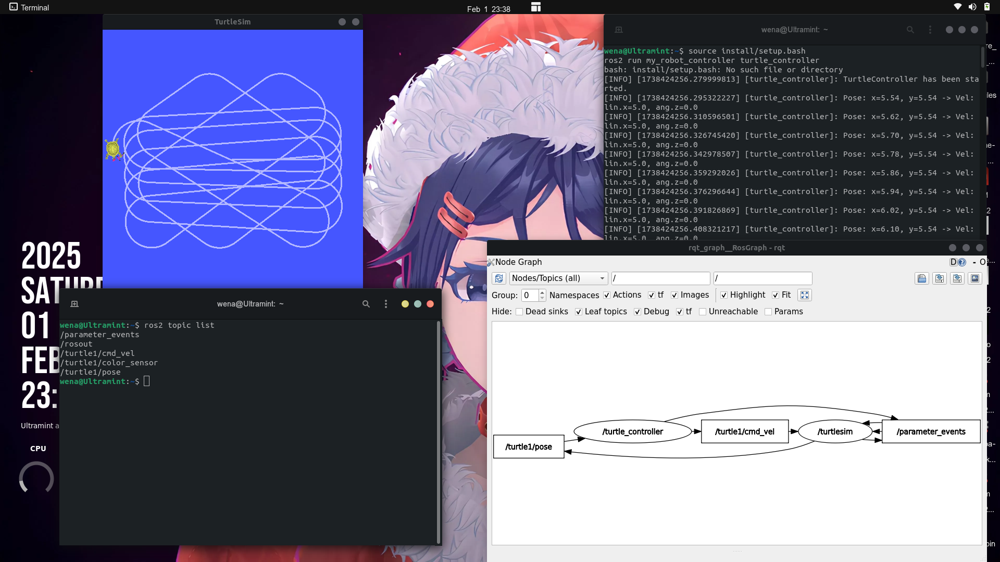

# ROS 2 Closed-Loop Turtle Controller

Tutorial ini menjelaskan cara membuat node ROS 2 dalam Python yang menggabungkan **subscriber** dan **publisher** dalam satu node untuk mengontrol pergerakan TurtleSim dengan sistem **closed-loop control**.

---

## Prasyarat

Pastikan Anda telah menginstal:

1. **ROS 2** (Disarankan menggunakan ROS 2 Humble atau yang lebih baru).
2. **TurtleSim**.
3. **Workspace ROS 2 yang telah dikonfigurasi** (`colcon` untuk build dan `setup.py`).

---

## Konsep Closed-Loop Control

Dalam tutorial ini, kita akan membuat **sistem kontrol tertutup** (closed-loop) di mana:

- **Subscriber** akan menerima posisi terkini TurtleSim dari topik `/turtle1/pose`.
- **Publisher** akan mengirimkan perintah kecepatan ke topik `/turtle1/cmd_vel` berdasarkan posisi TurtleSim.
- Jika TurtleSim mendekati batas jendela simulasi, ia akan berbelok secara otomatis agar tidak menabrak dinding.

---

## Implementasi

### 1. Buat Node Python

Pindah ke direktori package:

```bash
cd ~/ros2_ws/src/my_robot_controller/my_robot_controller
```

Buat file Python:

```bash
touch turtle_controller.py
chmod +x turtle_controller.py
```

Buka file `turtle_controller.py` dengan VSCode:
```bash
cd ~/ros2_ws/src/my_robot_controller
code .
```

Isi file `turtle_controller.py` dengan kode berikut:

```python
#!/usr/bin/env python3

import rclpy
from rclpy.node import Node
from geometry_msgs.msg import Twist
from turtlesim.msg import Pose

class TurtleControllerNode(Node):
    def __init__(self):
        super().__init__('turtle_controller')
        self.get_logger().info('TurtleController has been started.')
        
        # Create publisher
        self.cmd_vel_pub = self.create_publisher(Twist, '/turtle1/cmd_vel', 10)
        
        # Create subscriber
        self.pose_sub = self.create_subscription(Pose, '/turtle1/pose', self.pose_callback, 10)

    def pose_callback(self, pose: Pose):
        msg = Twist()
        
        # Jika Turtle mendekati batas, ubah arah
        if pose.x > 9 or pose.x < 2 or pose.y > 9 or pose.y < 2:
            msg.linear.x = 1.0  # Kecepatan linear lebih lambat
            msg.angular.z = 0.9  # Berbelok
        else:
            msg.linear.x = 5.0  # Kecepatan linear lebih cepat
            msg.angular.z = 0.0  # Tidak berbelok
        
        self.cmd_vel_pub.publish(msg)
        self.get_logger().info(f'Pose: x={pose.x:.2f}, y={pose.y:.2f} -> Vel: lin.x={msg.linear.x}, ang.z={msg.angular.z}')


def main(args=None):
    rclpy.init(args=args)
    node = TurtleControllerNode()
    rclpy.spin(node)
    node.destroy_node()
    rclpy.shutdown()

if __name__ == '__main__':
    main()
```

---

## Penjelasan Kode

#### Header
```python
#!/usr/bin/env python3
```
Menentukan interpreter Python 3.

---

#### Import Library
```python
import rclpy
from rclpy.node import Node
from geometry_msgs.msg import Twist
from turtlesim.msg import Pose
```
- **`rclpy`**: Library utama untuk ROS 2 di Python.
- **`Node`**: Kelas dasar untuk membuat node ROS 2.
- **`Twist`**: Jenis pesan untuk mengendalikan kecepatan TurtleSim.
- **`Pose`**: Jenis pesan untuk mendapatkan posisi TurtleSim.

---

#### Kelas `TurtleControllerNode`
```python
class TurtleControllerNode(Node):
    def __init__(self):
        super().__init__('turtle_controller')
        self.get_logger().info('TurtleController has been started.')
```
Menginisialisasi node dengan nama `turtle_controller` dan mencetak log saat node dijalankan.

---

#### Publisher dan Subscriber
```python
self.cmd_vel_pub = self.create_publisher(Twist, '/turtle1/cmd_vel', 10)
self.pose_sub = self.create_subscription(Pose, '/turtle1/pose', self.pose_callback, 10)
```
- **Publisher** mengirimkan perintah kecepatan ke `/turtle1/cmd_vel`.
- **Subscriber** menerima data posisi dari `/turtle1/pose` dan memprosesnya di `pose_callback()`.

---

#### Callback `pose_callback()`
```python
def pose_callback(self, pose: Pose):
    msg = Twist()
    
    if pose.x > 9 or pose.x < 2 or pose.y > 9 or pose.y < 2:
        msg.linear.x = 1.0
        msg.angular.z = 0.9
    else:
        msg.linear.x = 5.0
        msg.angular.z = 0.0
    
    self.cmd_vel_pub.publish(msg)
    self.get_logger().info(f'Pose: x={pose.x:.2f}, y={pose.y:.2f} -> Vel: lin.x={msg.linear.x}, ang.z={msg.angular.z}')
```
- Mengontrol kecepatan TurtleSim berdasarkan koordinatnya.
- Jika TurtleSim mendekati batas (x atau y lebih dari 9 atau kurang dari 2), ia akan berbelok.
- Jika tidak, TurtleSim akan terus bergerak lurus.

---

#### Fungsi `main()`
```python
def main(args=None):
    rclpy.init(args=args)
    node = TurtleControllerNode()
    rclpy.spin(node)
    node.destroy_node()
    rclpy.shutdown()
```
- Menginisialisasi dan menjalankan node.
- `rclpy.spin(node)` memastikan node tetap berjalan.

---

## 2. Tambahkan Dependensi di `package.xml`
Edit `package.xml` untuk menambahkan dependensi:

```xml
<depend>rclpy</depend>
<depend>geometry_msgs</depend>
<depend>turtlesim</depend>
```

---

## 3. Tambahkan Node di `setup.py`
Edit `setup.py` untuk menambahkan script:

```python
entry_points={
    'console_scripts': [
        'turtle_controller = my_robot_controller.turtle_controller:main',
    ],
},
```

---

## 4. Build Workspace
```bash
cd ~/ros2_ws
colcon build --symlink-install
```

---

## 5. Jalankan Node

### a. Jalankan TurtleSim
```bash
ros2 run turtlesim turtlesim_node
```

### b. Jalankan Controller
```bash
source install/setup.bash
ros2 run my_robot_controller turtle_controller
```

TurtleSim akan bergerak dan berbelok saat mendekati batas jendela simulasi.

---

## Debugging dan Verifikasi

### List Topik
```bash
ros2 topic list
```

### Data Topik
```bash
ros2 topic echo /turtle1/pose
```

---

## Hasil

   <p align="center">
     
   </p>
   
TurtleSim akan terus bergerak maju dan berbelok saat mendekati tepi layar.

---

Selamat mencoba! 🚀

